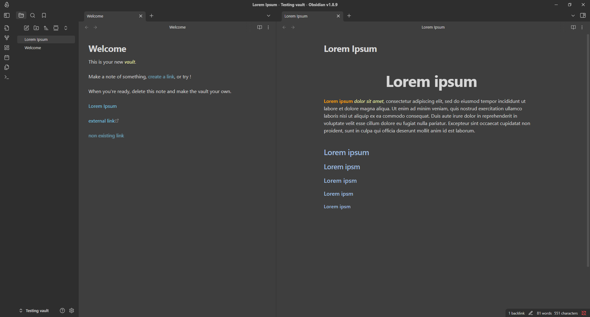
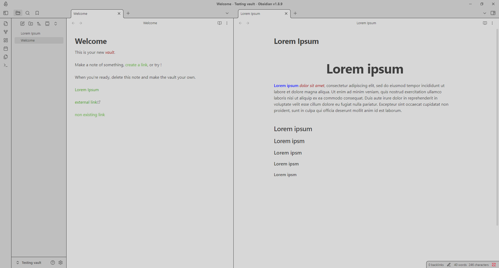
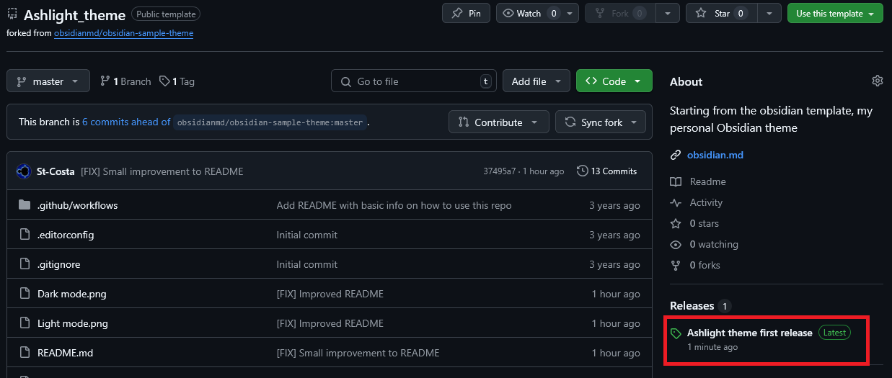
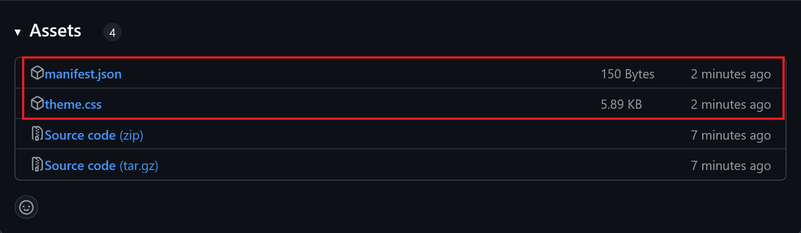

<h1 align="center">Ashlight</h1>

  <em>A clean, high-contrast Obsidian theme built for readability.</em> 

  
  
  

Ashlight is based on the design of my [personal website](https://github.com/St-Costa/stefanocosta.me). It favors a simple layout and deliberately high-contrast colors, so notes stay easy to read during long writing or reading sessions, in both light and dark mode.

## Screenshots

  

  

## Features

- Distinct color palettes for dark and light mode, tuned for contrast rather than pure aesthetics
- Centered, enlarged H1 headings for cleaner document titles
- Custom colors for bold and italic text, internal/external/unresolved links, and inline code
- A minimal, dependency-free `theme.css` — easy to read and easy to fork

## Installation

### From Obsidian (recommended, once published)

1. Open **Settings → Appearance → Themes → Manage**
2. Search for `Ashlight`
3. Click **Install**, then **Use**

### Manual installation

1. Go to the [Releases page](https://github.com/St-Costa/obsidian-ashlight/releases/latest) of this repository.

   

2. Download `manifest.json` and `theme.css` from the latest release.

   

3. Create a folder named exactly `Ashlight_theme` and place both files inside it.

   > The folder name matters — Obsidian uses it to identify the theme.

4. Move the `Ashlight_theme` folder into `<your vault>/.obsidian/themes/`.

   > `.obsidian` is a hidden folder — you may need to enable "show hidden files" in your file explorer.
   > If the `themes` folder doesn't exist yet, create it.

5. In Obsidian, go to **Settings → Appearance → Themes**, and select **Ashlight**.

## License

Ashlight is released under the [MIT License](LICENSE).
